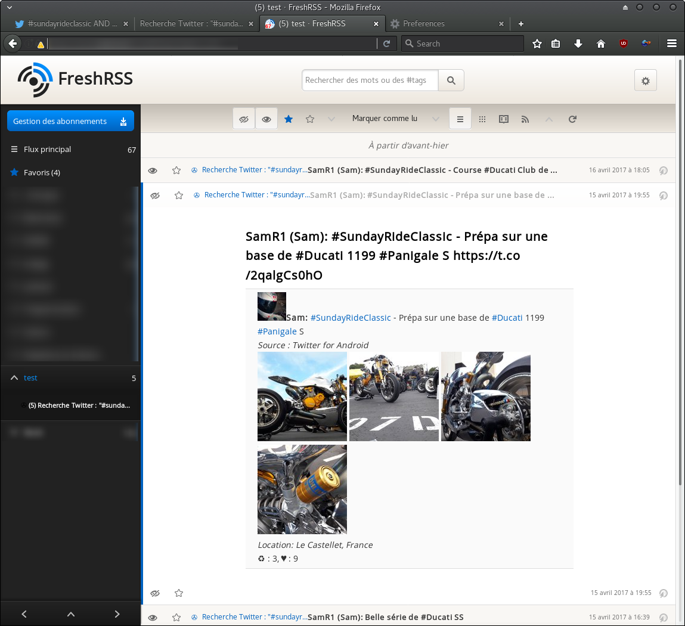
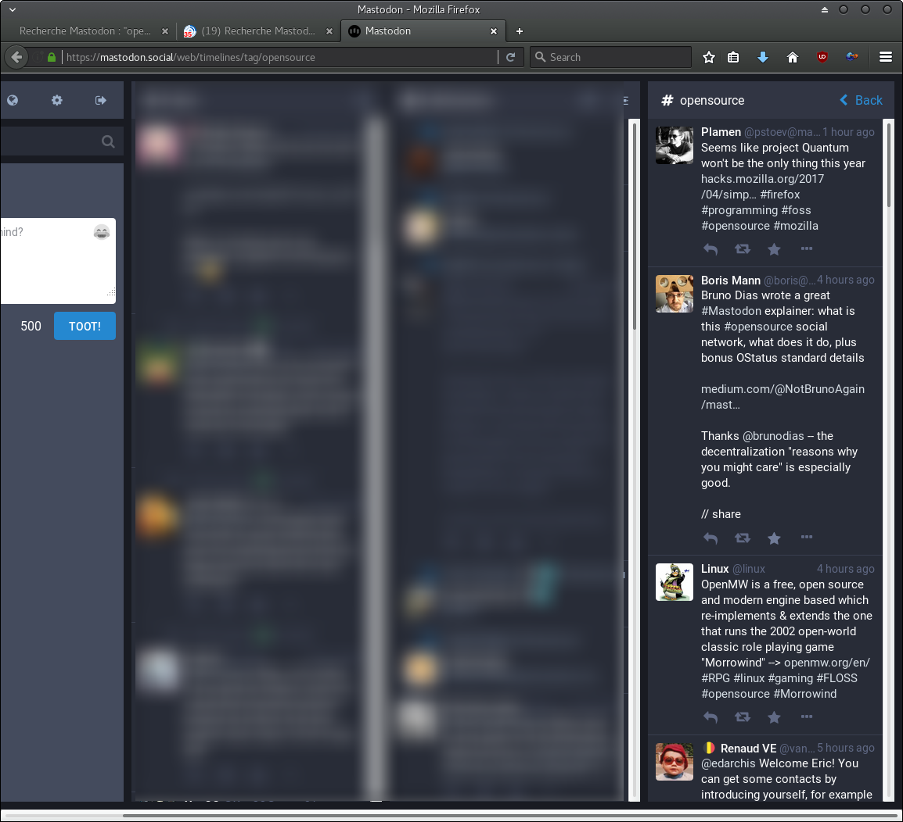
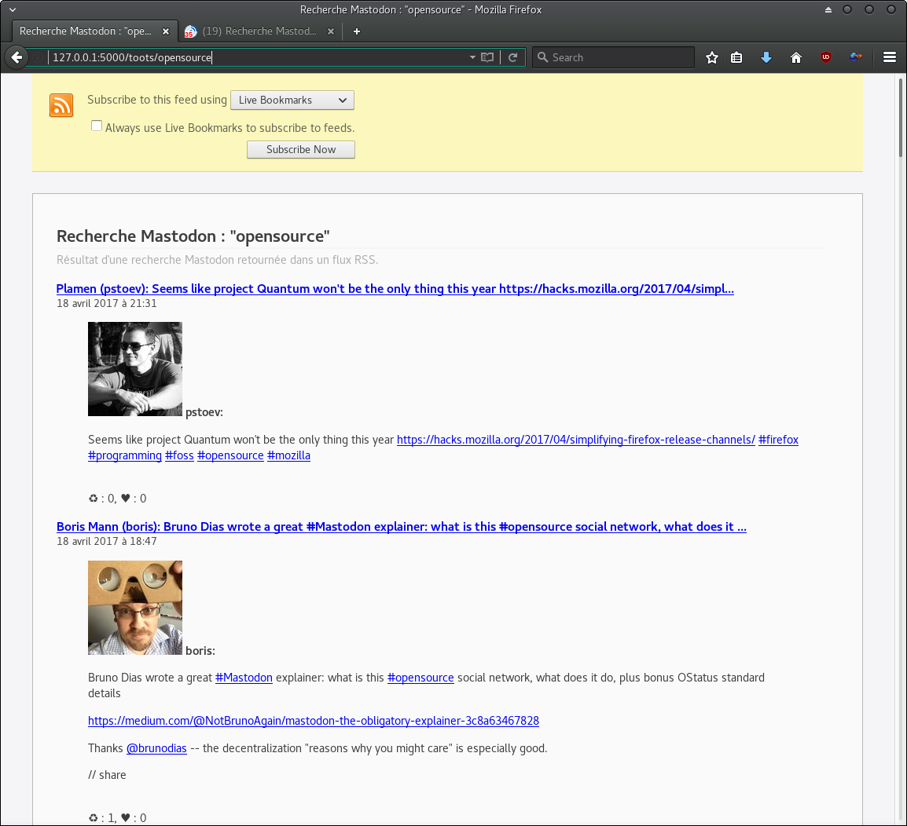

# python-twootfeed
**a Python script to generate a rss feed from parsed Twitter or Mastodon search and Mastodon favorites, using Flask.**  
  
[](https://python.org) 
[](https://www.codacy.com/app/SamR1/python-twootfeed) 
[](https://coveralls.io/github/SamR1/python-twootfeed?branch=master) 
[](https://travis-ci.org/SamR1/python-twootfeed)

---

The RSS feed displays only the original tweets (not the retweets) and :
- links to :  
  - the original tweet on Twitter or toot on Mastodon  
  - hashtags  
  - usernames  
- URLs 
- images
- source
- location  (only for Twitter)
- numbers of retweets (or boosts for Mastodon) and favorites  
(see examples below).  


## Requirements

- Python 3.6+
- API keys Twitter and/or Mastodon 

  
## Installation and configuration

- Install from pip

```bash
$ pip install twootfeed
```

- Initialize the configuration file
```bash
$ twootfeed_init
```

- Fill in fields for the client(s) you will use in **'~/.config/twootfeed/config.yml'** :
  - for **Twitter** : see https://apps.twitter.com  
  copy/paste the Twitter API key values in **config.yml** file ('_consumerKey_' and '_consumerSecret_')
  - for **Mastodon** : see [Python wrapper for the Mastodon API](https://mastodonpy.readthedocs.io/)  
  use the included script which will register your app and prompt you to log in, creating the credential files for you.
  ```bash
  $ twootfeed_create_mastodon_cli
  ```

- Start the app
```bash
$ twootfeed
```

## Usage 

The RSS feeds are available on these urls:  
  - for Twitter: http://localhost:8080/_keywords_ or http://localhost:8080/tweets/_keywords_
  - for Mastodon: 
    - search: http://localhost:8080/toots/_keywords_ 
    - connected user favorites: http://localhost:8080/toot_favorites


## Examples 

### Search on Twitter 

  

Results in RSS Feed:  
  
  
Display on FreshRSS, a great free self-hosted aggregator (https://github.com/FreshRSS/FreshRSS):   
  

### Search on Mastodon



Results in RSS Feed:  
 

Display on FreshRSS:  
  


## Contribute
see [Quick start for developers](https://github.com/SamR1/python-twootfeed/wiki/Quick-start-for-developers)


## Contributors
- [georgedorn](https://github.com/georgedorn)
